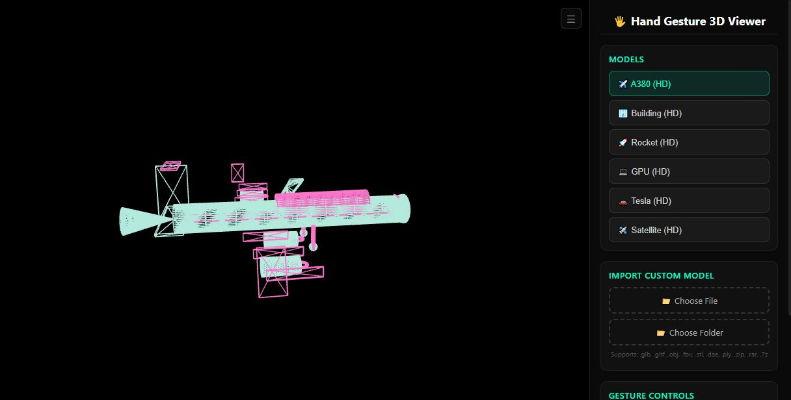
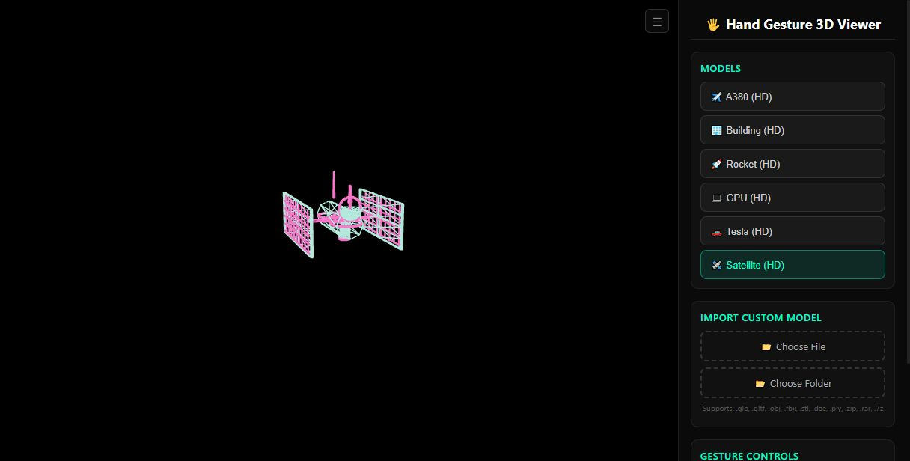
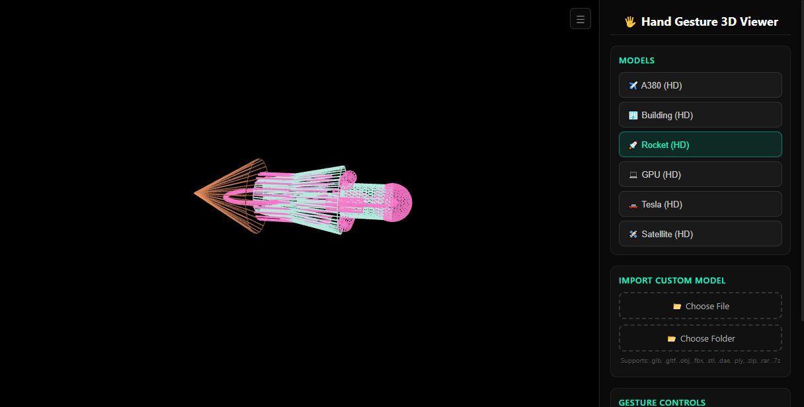

# 🖐️ Hand Gesture 3D Viewer

**Control 3D wireframe models with just your hands — no mouse, no keyboard, no touch.**

[](https://hand-gesture-3d-viewer.vercel.app)
[](https://threejs.org)
[](https://ai.google.dev/edge/mediapipe/solutions/vision/hand_landmarker)

---

## ✨ What Is This?

A browser-based 3D model viewer that uses your webcam to track hand gestures in real-time. Wave, pinch, and gesture your way through 6 high-detail wireframe models — no controllers needed. Built with Three.js, MediaPipe, and pure vanilla JS.

---

## 🎮 Gesture Controls

| Gesture | Action | Visual Feedback |
|---------|--------|----------------|
| ✌️ **Pinch + Drag** | Rotate model | Rotation indicator |
| 🤏 **Two-Hand Pinch** | Zoom in/out | Scale feedback |
| ✋ **Open Palm + Move** | Pan (follows hand) | Position tracking |
| ✊ **Fist (hold 1s)** | Reset view | Reset animation |
| ✌️ **Peace Sign** | Cycle to next model | Model name flash |
| 🤘 **Rock On** | Change wireframe color | Color transition |

---

## 🧩 Models Included

6 procedurally-generated HD wireframe models — no external assets needed:

| Model | Description |
|-------|-------------|
| ✈️ **A380 (HD)** | Double-deck airliner with full fuselage, wings, engines, tail |
| 🏢 **Building (HD)** | Multi-story skyscraper with grid windows, crown, antenna |
| 🚀 **Rocket (HD)** | Multi-stage rocket with boosters, fins, nose cone |
| 💻 **GPU (HD)** | Graphics card with PCB, fan, heatsink, ports |
| 🚗 **Tesla (HD)** | Cyber vehicle with body, wheels, doors, headlights |
| 🛰️ **Satellite (HD)** | Orbital satellite with solar panels, dish, thrusters |

---

## 📸 Screenshots

### A380 HD — Double-Deck Airliner


### Satellite HD — Orbital Satellite


### Rocket HD — Multi-Stage Rocket


---

## 🚀 Live Demo

**[hand-gesture-3d-viewer.vercel.app](https://hand-gesture-3d-viewer.vercel.app)**

> ⚠️ Requires a webcam and a modern browser (Chrome/Edge recommended). Allow camera access when prompted.

---

## 🛠️ Tech Stack

- **Three.js** — 3D rendering engine (wireframe mode)
- **MediaPipe Hands** — Real-time hand landmark detection
- **Vite** — Build tooling
- **Vercel** — Hosting & deployment
- **Vanilla JS** — Zero framework overhead

---

## 🏗️ Run Locally

```bash
git clone https://github.com/YOUR_USERNAME/hand-gesture-3d-viewer.git
cd hand-gesture-3d-viewer
npm install
npm run dev
```

Open `http://localhost:5173` in your browser.

---

## 📦 Build & Deploy

```bash
npm run build    # outputs to dist/
npx vercel --prod
```

---

## 🎨 Design Philosophy

- **Wireframe-only** — All models rendered in neon cyan (#00ffcc) with pink accents (#ff44aa)
- **Pure black background** — Zero distractions, maximum contrast
- **No grid** — Clean, floating-in-space aesthetic
- **Gesture-first** — The UI is minimal; your hands are the primary interface

---

## 📄 License

MIT — feel free to fork, remix, and build on top of this.

---

*Built with ❤️ and a lot of hand waving.*